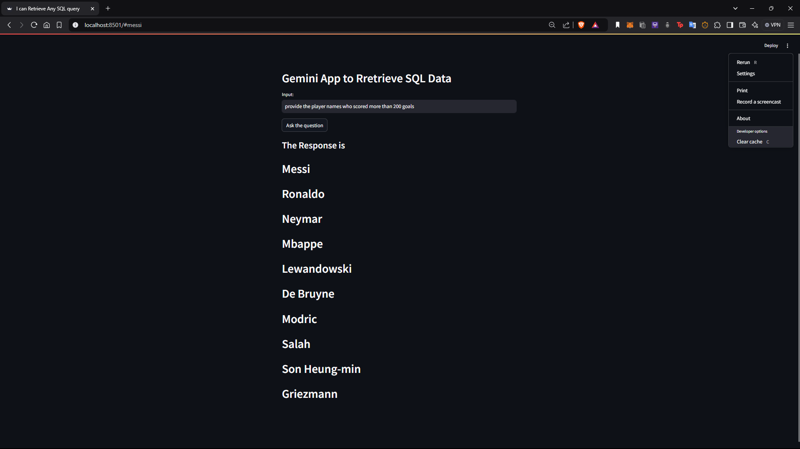
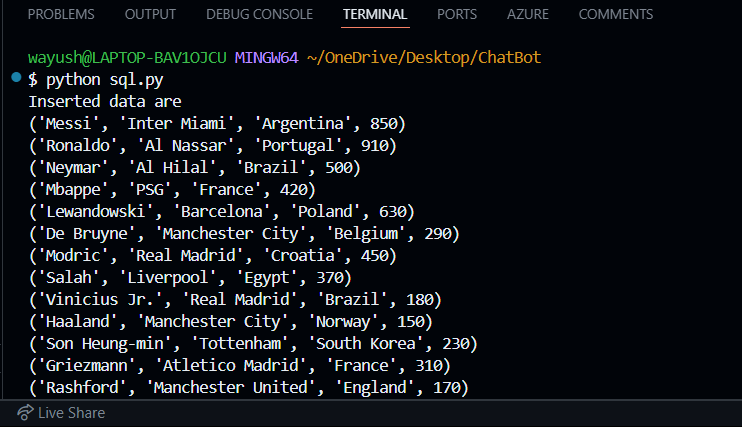

### Pre Requisites
1. conda search python
2. conda create -p ./venv python=3.13 -y

## Steps

1. conda activate venv/
2. pip install -r requirements.txt 
3. python sql.py (To add users to db)
4. streamlit run app.py

